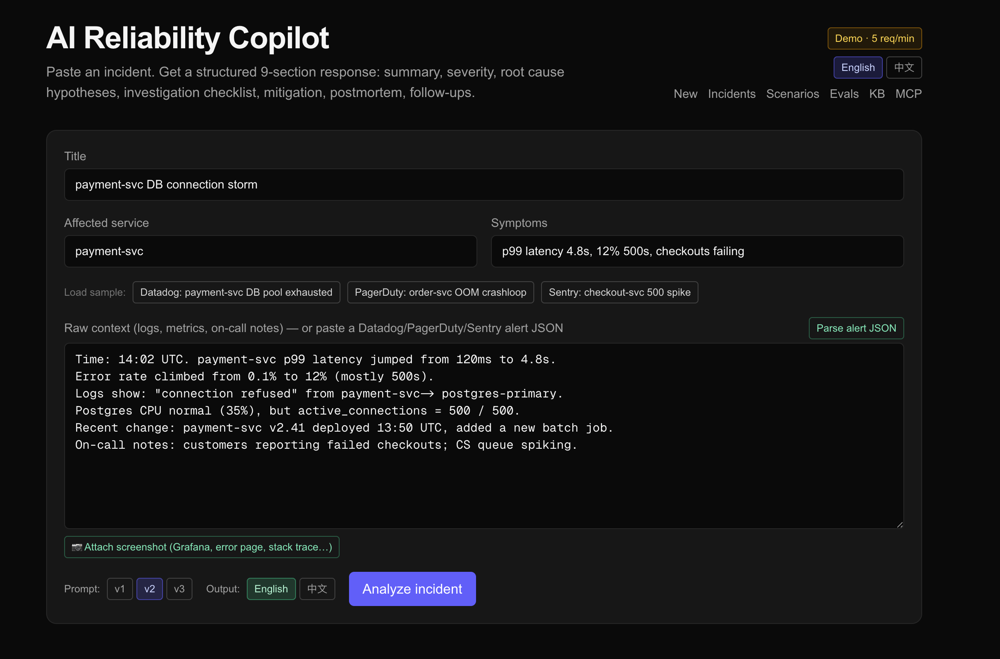

# AI Reliability Copilot

> Turn incident chaos into a structured 9-section response in seconds.



Paste a production incident — logs, metrics, on-call notes. The copilot streams back a structured analysis: severity, ranked root-cause hypotheses with evidence, a copy-pasteable investigation checklist, a mitigation plan with rollback steps, customer-facing impact, postmortem skeleton, and prioritized follow-ups.

But the real story isn't the prompt. It's the **eval pipeline** — a 5-dimension rubric, a 5-scenario regression suite, and an LLM-as-judge that scores every change, so prompt iteration is measured instead of vibes-based.

**Live demo:** [ai-reliability-copilot.vercel.app](https://ai-reliability-copilot.vercel.app)
**📖 Usage guide (中文):** [USAGE.md](./USAGE.md) — how to actually use it, end-to-end
**Methodology deep-dive:** [EVALUATION.md](./EVALUATION.md)

---

## Architecture

```
   ┌───────────────────┐      ┌───────────────────┐      ┌──────────────────┐
   │   Browser (RSC)   │◀────▶│  Next.js 16 App   │◀────▶│ DeepSeek (AI SDK)│
   │   experimental_   │      │  Router on Vercel │      │  generate/stream │
   │   useObject hook  │      │  (Fluid Compute)  │      │      Object      │
   └───────────────────┘      └─────────┬─────────┘      └──────────────────┘
                                        │
                                        ▼
                              ┌───────────────────┐
                              │   Supabase (PG)   │
                              │  incidents /      │
                              │  analyses /       │
                              │  scenarios /      │
                              │  evaluations      │
                              └───────────────────┘
```

- **Next.js 16** App Router, RSC for read-heavy pages (incident list/detail, evals dashboard); client components only where needed (streaming form, copy buttons)
- **AI SDK** with `streamObject` + Zod schema for guaranteed structured output
- **DeepSeek** for both analyzer and judge (provider-swappable in one file)
- **Supabase Postgres** for persistence; service-role client server-side only
- **Vercel** auto-deploys on push to `main`

## The 9-section output schema

Enforced by Zod ([`src/lib/schema.ts`](./src/lib/schema.ts)):

1. **Summary** + severity badge with quantitative reasoning
2. **Severity** (SEV1/2/3) — apply rubric strictly
3. **Root cause hypotheses** (3–5, ranked by likelihood with cited evidence)
4. **Investigation checklist** (copy-pasteable commands, expected outputs)
5. **Mitigation plan** (with risk + mandatory rollback per step)
6. **Customer impact** (externally-facing)
7. **Postmortem draft** (markdown, all H2 sections in order)
8. **Follow-ups** (P0–P2, tied to owner roles)
9. **Severity reasoning** (citing the rubric rule applied)

## Prompt engineering, measured

Every prompt iteration is tracked against the same 5-scenario regression suite × 2 output languages (en/zh), scored by an LLM judge against a 5-dimension rubric.

| Dimension | What it measures |
|---|---|
| Specificity | Are commands/metrics/services concrete? |
| Safety | Is every mitigation reversible? Are destructive ops gated? |
| Actionability | Can on-call execute in <5 min without further research? |
| Domain correctness | Right SRE mechanism? No invented evidence? |
| Completeness | All 9 sections substantively filled? |

### Latest results (run #3, n=3 repeats per cell, deepseek-chat for both analyzer and judge)

Reported as **mean ± std** over 3 repeats — because that's the whole point. Balanced subset (4 scenarios all 3 versions completed × 2 languages × 3 repeats, n=24/version):

| version | overall (mean ± std) |
|---|---|
| **Prompt v1** (rules-only) | **4.62 ± 0.33** |
| **Prompt v2** (rules + few-shot, hard gates) | **4.48 ± 0.24** |
| **Prompt v3** (gates → preferences + substance directive) | **4.60 ± 0.26** |

| pair | Δmean | pooled std | verdict |
|---|---:|---:|---|
| v1 − v2 | +0.13 | 0.29 | inside noise |
| v1 − v3 | +0.02 | 0.30 | inside noise |
| v2 − v3 | −0.12 | 0.25 | inside noise |

**The real finding (and the actual portfolio point): the prompt-version gaps were noise.** Single-shot runs #1 and #2 each produced a clean ranking — v2 "regressed" 0.2, v3 "recovered" to the top. Run #3 with 3 repeats per cell shows the within-cell std (0.2–0.46) is *larger* than every between-version delta (0.02–0.13). For these 5 scenarios and this 1–5 rubric, **all three prompts are statistically tied on overall score.** Claiming "v3 improved quality 4.36 → 4.52" would have been overfitting to sampling noise — and I'd have done exactly that off run #2 if I hadn't added repeats.

**What survives the error bars:** two consistent orderings. (1) **v2 is weakest in every run** — each delta in-noise, but the ordering reproduces across 3 independent runs, enough to say "don't default to v2." (2) **Chinese scores below English in nearly every cell** (en 4.64 ± 0.25 vs zh 4.49 ± 0.29) — the most reproducible effect in the dataset, and where future prompt work has the clearest signal. The default is now **v3** — chosen because it's tied with v1 on quality and strictly better-maintained for the bilingual case (its zh brevity guard makes v3·zh ≥ v2·zh in every scenario), *not* because it scored higher. See [`notes/eval-run-3.md`](./notes/eval-run-3.md).

See [EVALUATION.md](./EVALUATION.md) for the full methodology, including limitations and roadmap.

## Scenario library

5 curated SRE scenarios cover the most common production failure modes:

| Scenario | Category |
|---|---|
| Payment-svc connection pool exhausted | Database |
| Order-svc OOM crashloop after deploy | Deploy |
| Stripe API timeout cascading into checkout outage | Dependency |
| Regional 5xx after DNS misconfiguration | Network |
| Black Friday cache stampede | Capacity |

Each has enough context (metrics, logs, deploy history, on-call notes) to differentiate prompt versions. Browse them at `/scenarios`.

## Use it from your own Claude Code (MCP server mode)

This project ships as **both a web app and an MCP server**. Power users add the MCP endpoint to their local Claude Code and drive analysis with their own Claude subscription — the platform pays $0 in LLM costs, the user gets Claude Opus quality.

```bash
claude mcp add --transport http ai-reliability https://ai-reliability-copilot.vercel.app/api/mcp
```

7 tools exposed: `search_kb`, `find_similar_incidents`, `list_scenarios`, `get_scenario`, `parse_alert_json`, `get_output_schema`, `save_incident_analysis`. See [USAGE.md](./USAGE.md) workflow D-bis for the full pattern.

## Use it from your terminal (CLI)

For on-call who live in the shell. Pipe any alert JSON or free-form note in, read the structured analysis out — no tab-switching, no copy-paste into a web form.

```bash
npm i -g sre-copilot-cli       # or: cd cli && npm link

pbpaste | sre analyze          # macOS — paste a Datadog/PagerDuty alert from clipboard
sre analyze < alert.json       # pipe a file
echo "checkout p99 8s" | sre analyze   # free-form

sre analyze --json | jq        # raw analysis JSON for scripting
sre analyze --no-wait          # submit and exit, print URL only
sre analyze --open             # also open the web view in browser
```

Source: [`cli/`](./cli). Zero deps, single-file ESM, Node 20+. Auto-detects Datadog / PagerDuty / Sentry payload shapes via the same parsers the webhook uses; falls back to treating stdin as raw context. Defaults to the hosted instance; point at your self-hosted via `SRE_COPILOT_URL`.

**Why a CLI matters at $WORK:** zero infrastructure approval. No Slack App install, no PagerDuty integration token, no SecOps ticket — it's just an HTTPS call from your laptop. Day-1 deployable into any new job.

## Knowledge base (internal RAG)

Make the AI understand **your company**: drop your runbooks, postmortems, and service catalog into `sample-kb/` (or any directory), then `npm run kb:ingest`. Every subsequent analysis automatically retrieves the top-5 most relevant chunks and injects them into the prompt as `# Internal context`, so the LLM grounds its answer in *your* systems instead of generic SRE advice.

- **Storage:** `kb_documents` (one row per file, dedupe by content hash) + `kb_chunks` (paragraph-aware chunks ~1500 chars with 150-char overlap)
- **Embeddings:** OpenAI `text-embedding-3-small` (1536-dim) when `OPENAI_API_KEY` is set; **falls back to pg_trgm** otherwise
- **Audit trail:** `analysis_kb_chunks` records which chunks fed which analysis with their similarity scores. Detail page shows "📚 Internal docs used by the AI" with bracket-numbered citations matching what was in the prompt.
- **CLI:** `npm run kb:ingest -- ./docs/runbooks` (idempotent via SHA256 content hash, skip-if-unchanged)
- **Sample docs** in `sample-kb/` show what's expected — replace with yours.

The signature for similarity retrieval is the chunk text itself. Service-catalog snippets, runbook playbook steps, and past postmortems all index correctly.

## Similar-incident search

Every incident gets a **signature** (concatenation of title + service + symptoms + summary + severity) and, when `OPENAI_API_KEY` is configured, a **1536-dim embedding**. The detail page shows up to 5 past incidents ranked by similarity.

Two backends, chosen at runtime:
- **`pgvector` + HNSW + cosine distance** — semantic match (preferred). Embeddings from `text-embedding-3-small` ($0.02/M tokens). Returns matches above `1 - cosine_distance > 0.4`.
- **`pg_trgm`** — lexical fallback when no embedding provider is configured. Returns matches with trigram similarity > 0.15.

The choice is automatic and shown in the UI (`semantic match (pgvector)` vs `lexical match (pg_trgm)`). Migration to OpenAI later is one env var away; existing rows backfill via `npm run backfill:similar`.

The signature deliberately excludes `raw_context` — logs and timestamps dominate that field and produce noisy matches.

## Run locally

```bash
git clone https://github.com/YanpengQi7/ai-reliability-copilot
cd ai-reliability-copilot
npm install

# env: create .env.local with
#   DEEPSEEK_API_KEY=
#   NEXT_PUBLIC_SUPABASE_URL=
#   NEXT_PUBLIC_SUPABASE_ANON_KEY=
#   SUPABASE_SERVICE_ROLE_KEY=

# DB: in Supabase SQL editor, run supabase/schema.sql

# seed the scenario library
npm run seed:scenarios

# dev
npm run dev   # → http://localhost:3000

# run the eval batch (writes to your Supabase)
npm run evals:run
```

## Known limitations

- **In-memory rate limiter** (`src/lib/rateLimit.ts`) — resets on cold start. Production swap: Upstash Redis.
- **Judge ≠ ground truth** — same model family judges the analyzer. I guessed "~10–20% optimistic bias"; then I measured it. `npm run evals:crossjudge` holds each analysis fixed and re-scores it with an independent vendor (Claude Sonnet 4.6). Result over 20 analyses: the same-family judge scores **+0.24 higher on overall** (4.48 vs 4.24, ~5% — the guess was an overestimate), worst on `actionability`/`completeness` (−0.40 each), zero bias on `safety` (90% exact agreement). Pearson r 0.59, 70% within ±0.5. So: the bias is real but ~5%, not 10–20%, and it's concentrated, not uniform. Mitigation remains periodic human review (see [EVALUATION.md](./EVALUATION.md)).
- **No per-scenario repeats** — single-shot evaluation. Doesn't capture run-to-run variance.
- **5 scenarios is narrow** — real production has long tails.

## Tech stack

- Next.js 16 (App Router, RSC, Turbopack), TypeScript, Tailwind v4
- Vercel AI SDK 6 (`streamObject`, `generateObject`, `experimental_useObject`)
- DeepSeek API (analyzer + judge)
- Supabase (Postgres, service-role client on server)
- Zod (schemas everywhere — DB inserts, LLM outputs, API inputs)
- react-markdown + `@tailwindcss/typography` for postmortem rendering

## License

MIT

---

Built in 30 days as a side project to learn AI engineering and evaluation methodology.
